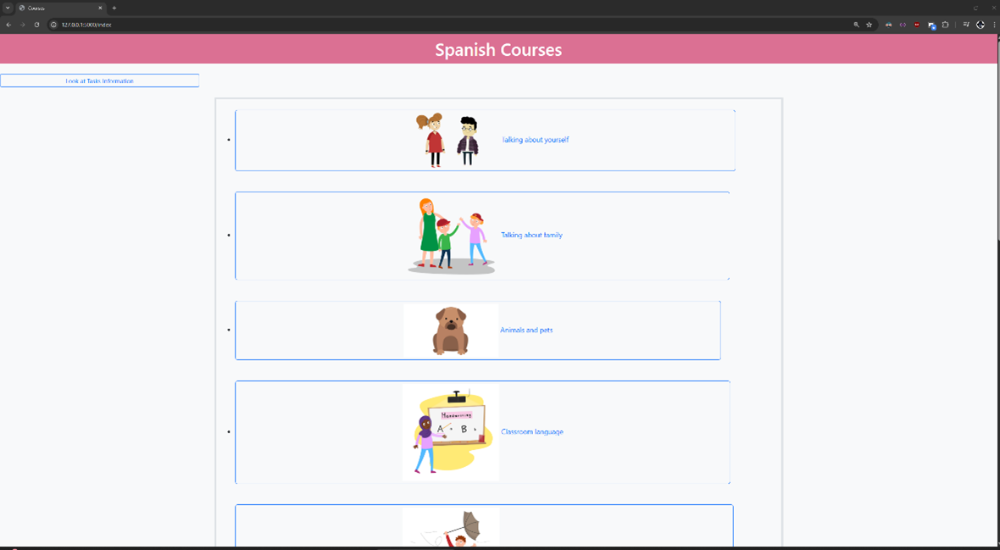

# Virtual Tutor

## Overview

**Virtual Tutor** is a web-based platform built using **Python**, **Flask**, **HTML/CSS**, and **JavaScript**, designed to deliver **adaptive** and **personalized learning experiences** through the integration of **Large Language Models (LLMs)** and **Fuzzy Logic**.

### Objectives

To achieve the project’s goal, the following objectives were addressed:

* Research how virtual tutors are being developed and implemented in education
* Explore how e-learning platforms enable adaptive and personalized learning
* Study various AI techniques used in e-learning and their applications
* Develop a low-cost prototype of an AI-driven e-learning platform
* Evaluate the effectiveness of the virtual tutor compared to traditional e-learning platforms

## Installation Guide

Please refer to the file `Guide on the application setup.docx` for detailed instructions on installing and running the application.

> ⚠️ **Note**: This repository does **not** include the `data` and `static` folders (which contain course texts, quizzes, and images) due to copyright restrictions.

## Features and Results

### 📄 Text-to-HTML Conversion with Markdown

Markdown is used to convert educational content into HTML-style formats, allowing easy and dynamic text deployment.

---

### 📚 Course Display

Courses stored in the backend are dynamically loaded and displayed.

---

### ✅ Course Selection

Users can select a course to begin learning.

---

### 🤖 Chat with the Virtual Tutor

Users can interact with the virtual tutor powered by an LLM for personalized assistance.

---

### 🧠 Virtual Tutor Feedback on Quizzes

The tutor provides instant feedback on quiz responses.
#### ✔️ Upon Correct Answer

#### ❌ Upon Incorrect Answer

#### Overall Feedback using Fuzzy Logic

